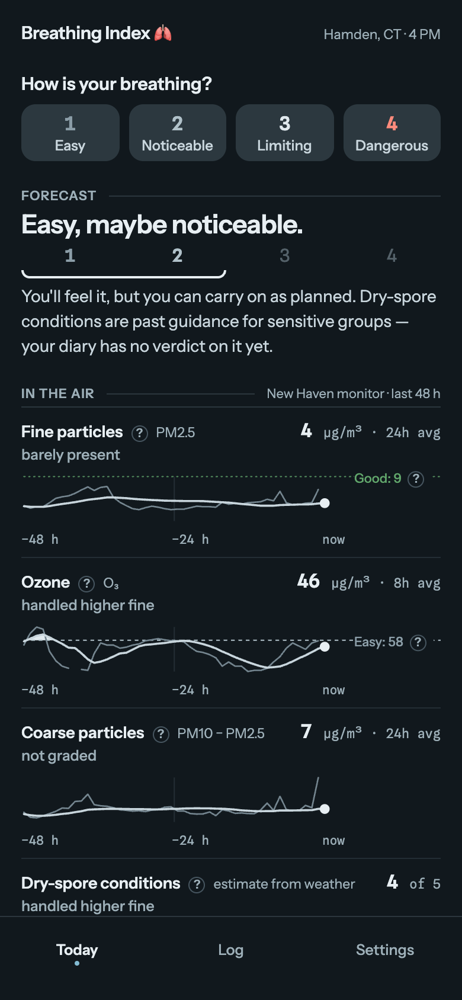
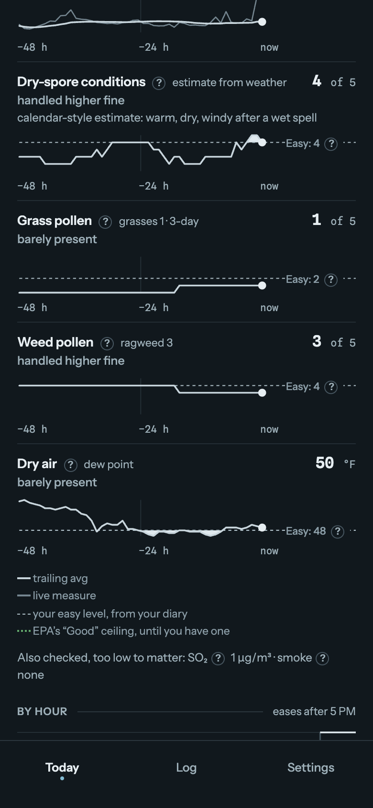
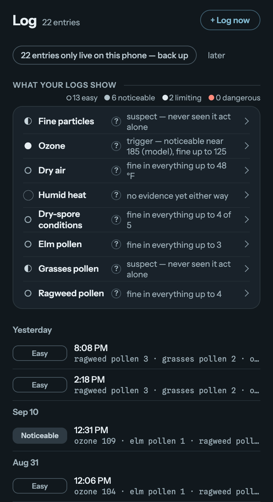

# breathing-index

A personal air quality PWA. Live at [breathingindex.com](https://breathingindex.com/).

<table>
<tr>
<td width="33%"></td>
<td width="33%"></td>
<td width="33%"></td>
</tr>
<tr>
<td colspan="3" align="center"><em>Twenty-two real entries from my own diary, in Hamden, on the New Haven monitor. The dashed line on each row is my easy level rather than the EPA's, because there are enough logs now to have one. Ozone came out a trigger; dry air and the pollens have so far not.</em></td>
</tr>
</table>

## Why

I’ve always struggled to correlate the published air quality index with my personal ability to breathe. It’s no fun being gaslit by a “moderate” AQI of 70 that some days is fine to breathe and somedays is cripplingly bad. The AQI is doesn't take into account how the combination of pollutants affects breathing, but your lungs sure do! So this app helps you create your own BQI (Breathing Quality Index) by recording how you feel about your breathing alongside a vector of all available measures, helping you map how your lungs are affected by different pollutants like ozone, smoke, pollen, dust, mold, etc, many of which are lumped into broad-based categories by AQI that, again, your lungs don't consider whilst breathing.

Instead of a uselessly granular 1-500 AQI index, your BQI has four ratings:  
1. Easy -- choose this when you can take a carefree breath of fresh air and are enjoying life without thinking about your asthma  
2. Noticeable -- choose when you can notice something's off but can otherwise carry on with your plans, e.g. your mid-afternoon walk  
3. Limiting -- when you have to cut your walk short or use the peloton instead.  
4. Dangerous -- when you're worried about your ability to keep breathing.  

Each log entry is a 1–4 rating plus the full exposure vector at log time. A good entry is tolerance evidence for everything in that entry's measured air; a bad entry with several elevated variables produces an ambiguous candidate set, which the model keeps as-is until later entries confirm one candidate or exonerate another. The full model, with worked examples, is in [docs/trigger-model.md](docs/trigger-model.md); product spec and milestones are in [SPEC.md](SPEC.md).

Official composite indices (US AQI, EU EAQI) are captured on each log entry for possible later comparison, but never appear in the UI and are never used by inference.

## Stack

TypeScript, React, Vite, TanStack Router (file-based routes), vite-plugin-pwa. The inference engine is a pure module at `src/engine/` with no UI dependencies; its contract is the fixture suite at `tests/fixtures/trigger-cases.json` (16 cases, 39 assertions, run with vitest).

## Data sources

- **Open-Meteo** air quality + weather APIs — model data, no key required, worldwide.
- **AirNow** monitoring-site observations through the relay — hourly station concentrations, US only. In the US, with a monitor nearby reporting both PM2.5 and ozone, these *are* the exposure vector and entries log against `source: 'airnow'`; otherwise they stay a comparison strip and the model drives.
- **Mold counting stations** through the relay — nobody sells a trap-derived spore count, so the relay scrapes the health departments and hospitals that post one on a web page each weekday morning; you pick a station by name in Settings, and everywhere without one in reach gets `dry_spore_index`, a count of the five weather conditions that put dry-weather spores in the air ([specs/28-mold.md](specs/28-mold.md)).
- **NOAA HMS** smoke plumes through the relay — an hourly satellite analysis of where the smoke is, as Light/Medium/Heavy polygons. The relay answers whether a plume covers your grid cell; the density becomes an exposure variable of its own only when the hour's PM2.5/PM10 split says the particulate you are standing in is fine-mode, because HMS sees a column from above and a plume aloft over clean air looks the same to it. North America only.

All fetching is client-side; there is no backend. Logs live in `localStorage` — export and import are in Settings. Pollen keeps a small history there too: the measured feed serves today forward, and grass is graded over the trailing three days ([docs/trigger-model.md](docs/trigger-model.md)), so the app writes each day down as it passes — capped, per coarse grid cell, and never the forecast days that arrive with it — instead of asking for a past nobody publishes. Smoke keeps the same kind of memory for the same reason, by the hour rather than the day.

Freshness comes from the payload's own newest hour rather than from when the response arrived: the service worker serves Open-Meteo network-first with a six-hour cache, so a cache hit is indistinguishable from a live fetch at arrival time. With no readings at all the quick log still works — the rating saves at once and picks up the exposure vector for its hour from Open-Meteo's three-day history on the next successful fetch. Until it does, the entry stays out of inference.

Temperatures display in °F for browsers whose locale resolves to a Fahrenheit region and °C everywhere else, overridable in Settings. Stored exposures are always metric, so the setting relabels the display and never rewrites logged history.

The palette follows `prefers-color-scheme`, with no manual toggle: a 4 AM breathing check should not be a flashlight to the face, and the four severity colours are re-pointed rather than inverted so the quiet end of the ramp stays quiet on a dark ground. Every screenshot in this README is the dark palette at phone size; [Settings](docs/img/dark-settings.png) and the [first-run screen](docs/img/dark-intro.png) are in `docs/img/` too.

Analytics is Mixpanel, lazy-loaded, pseudonymous (a device ID, not an account) and content-free: events record that a screen was viewed or an entry saved, never what was rated, tagged, noted, or measured, and IP geolocation is off. Turn it off entirely in Settings. Fonts are self-hosted, so the app makes no third-party request for chrome either.

`public/privacy.html` and `public/terms.html` are prerendered documents served straight off disk at `/privacy` and `/terms` — no bundle, no router, and excluded from the service worker's navigation fallback. The privacy page enumerates every event and property the app sends; it is a contract, so any change to a `track()` call site belongs in the same commit as the change to that page.

## Development

```sh
npm install
npm run dev     # local dev server
npm test        # breakpoint-derivation check + engine fixture suite (vitest)
npm run build   # vite build + typecheck
```

Deploys to GitHub Pages via Actions on every push to `main`. To redeploy without a new commit — or when an Actions incident swallows the push trigger — dispatch it manually:

```sh
gh workflow run deploy.yml
```
